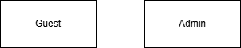

# Requirement Analysis in Software Development

## What is Requirement Analysis?

Requirement Analysis is a critical phase in the Software Development Life Cycle (SDLC) that involves identifying, documenting, and analyzing the needs and expectations of stakeholders. This process ensures that the final product aligns with user requirements and business objectives.

### Importance in the SDLC

Requirement Analysis serves as the foundation for all subsequent development activities. It helps in:

- **Defining Clear Objectives**: Establishes a shared understanding of project goals among stakeholders.
- **Risk Mitigation**: Identifies potential issues early, reducing the likelihood of costly changes later.
- **Improved Communication**: Facilitates better collaboration between stakeholders and the development team.
- **Enhanced Quality and Usability**: Ensures the product meets user needs and quality standards.
- **Cost and Time Efficiency**: Reduces unnecessary revisions and rework, keeping the project within budget and on schedule.
- **Scope Management**: Prevents scope creep by clearly defining project boundaries.
- **Better Project Planning**: Enables accurate timelines, resource allocation, and budget estimates. :contentReference[oaicite:0]{index=0}

## Why is Requirement Analysis Important?

Requirement Analysis is essential for several reasons:

- **Clear Understanding of Objectives**: Helps in clearly defining the project’s goals and objectives. By understanding what the stakeholders want to achieve, development teams can align their efforts towards delivering a product that meets these goals.
- **Risk Mitigation**: Early identification of potential issues and risks is a crucial benefit of thorough requirement analysis. By understanding the project requirements in detail, teams can foresee potential problems and devise strategies to mitigate them.
- **Improved Communication**: Effective requirement analysis facilitates better communication between stakeholders and the development team. It provides a documented reference that can be used to ensure all parties have a shared understanding of the project scope, objectives, and constraints.
- **Enhanced Quality and Usability**: A detailed requirement analysis ensures that the final product will be functional and user-friendly. By involving users in the requirement gathering process, developers can gain insights into their needs and preferences, leading to a product that offers a superior user experience and meets quality standards.
- **Cost and Time Efficiency**: Accurate requirement analysis can significantly reduce the cost and time of software development. By clearly defining requirements upfront, the development team can avoid unnecessary revisions and rework. This leads to more efficient use of resources and ensures the project stays within budget and on schedule.
- **Scope Management**: Requirement analysis helps in defining the project scope accurately. This includes what will be included in the project and what will not. Clear scope management prevents scope creep, where additional features and functions are added without corresponding adjustments to time, cost, and resources.
- **Better Project Planning**: With a comprehensive understanding of the requirements, project managers can create more accurate project plans. This includes realistic timelines, resource allocation, and budget estimates. Effective planning leads to smoother project execution and better management of project milestones. :contentReference[oaicite:1]{index=1}

## Key Activities in Requirement Analysis

The Requirement Analysis phase encompasses several key activities:

- **Requirement Gathering**: Collecting information from stakeholders through interviews, surveys, and workshops to understand their needs and expectations.
- **Requirement Elicitation**: Refining and elaborating on gathered requirements using techniques like brainstorming and prototyping.
- **Requirement Documentation**: Creating detailed documents such as requirement specifications and use cases to formally capture the requirements.
- **Requirement Analysis and Modeling**: Analyzing and modeling the requirements to ensure they are complete, consistent, and feasible.
- **Requirement Validation**: Reviewing and validating requirements with stakeholders to ensure accuracy and alignment with business objectives.

## Types of Requirements

### Functional Requirements

Functional requirements describe what the system should do. They define specific behaviors, features, and functionalities that the system must have to meet user needs.

**Examples for a Booking Management System**:

- **User Authentication**: The system must allow users to log in using a valid username and password.
- **Room Inventory Management**: Manage room details, including room types, amenities, rates, and availability.
- **Booking Management**: Facilitate room bookings, including reservation creation, modification, and cancellation.
- **Availability Search**: Provide search functionality to check room availability based on date, room type, and other filters.
- **Booking Confirmation and Notifications**: Send booking confirmations to users via email or SMS, including reservation details and instructions. :contentReference[oaicite:2]{index=2}

### Non-functional Requirements

Non-functional requirements define how the system should perform. They specify the quality attributes, performance standards, and constraints that the system must adhere to.

**Examples for a Booking Management System**:

- **Performance**: The system should handle up to 1000 concurrent users with response times of less than 2 seconds.
- **Security**: The system must ensure data encryption for all sensitive information.
- **Usability**: The system must be user-friendly and accessible to users with disabilities.
- **Scalability**: The system should be able to scale to accommodate future growth in users and data. :contentReference[oaicite:3]{index=3}

## Use Case Diagrams

Use Case Diagrams are visual representations that show the interactions between users (actors) and the system. They help in identifying the system's functionalities and the users who will interact with them.

**Benefits**:

- Clarifies system functionality from the user's perspective.
- Identifies system boundaries and user roles.
- Serves as a communication tool between stakeholders and developers.

**Example**:

## Acceptance Criteria

Acceptance Criteria define the conditions that a feature must meet to be accepted by stakeholders. They provide clear and testable requirements that ensure the system meets user expectations.

**Importance**:

- Ensures that features are developed according to stakeholder needs.
- Provides a basis for testing and validation.
- Helps in managing scope and preventing scope creep.

**Example for the Checkout Feature**:

- Users must be able to select a room and proceed to checkout.
- The system must calculate the total price, including taxes and fees.
- Users must receive a confirmation email with booking details upon successful payment.

---

Feel free to reach out if you need further assistance or modifications to this content!
